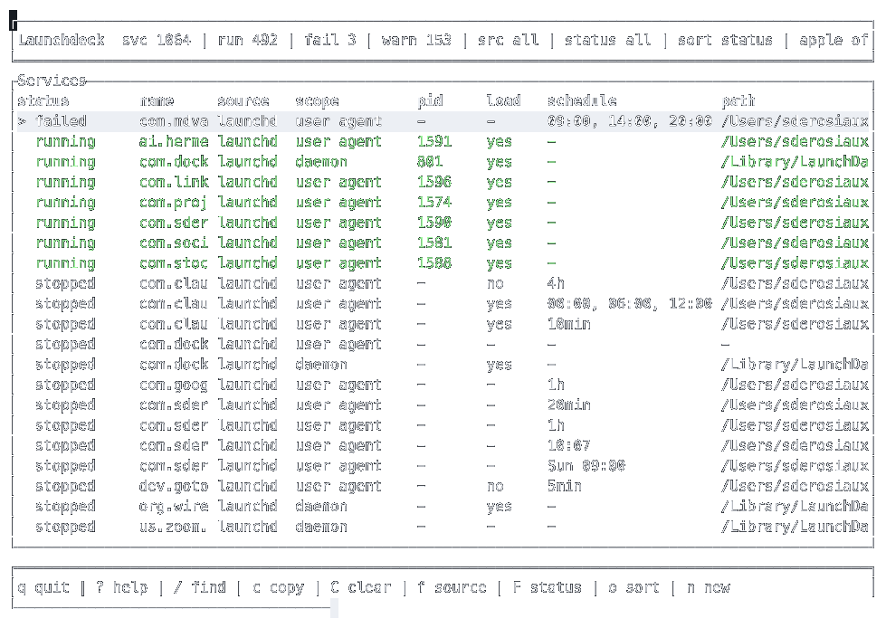

# Launchdeck

Launchdeck is a keyboard-first macOS TUI for inspecting and managing `launchd` jobs and Homebrew services from one place.

It is built for the common macOS developer setup where background processes are split between raw plist files in `~/Library/LaunchAgents` and services managed through `brew services`.



## Features

- Unified service list for `launchd` jobs and Homebrew services
- Homebrew service discovery through `brew services list --json`
- Runtime status from `launchctl`
- Search, source filters, status filters, warnings-only filter, and sorting
- Detail view with colored fields for service metadata, commands, plist paths, and health warnings
- Log preview from configured `StandardOutPath` and `StandardErrorPath`
- Background refresh so scrolling stays responsive
- Guarded lifecycle actions with confirmation before any command runs
- Safety blocks for system, admin-required, and vendor/runtime services

## Install

Launchdeck currently builds from source.

```sh
git clone git@github.com:sderosiaux/launchdeck.git
cd launchdeck
cargo build --release
```

Run the release binary:

```sh
./target/release/launchdeck
```

Or run it directly during development:

```sh
cargo run
```

## Usage

```sh
launchdeck
```

Non-interactive inventory output:

```sh
launchdeck --list
```

When running from source:

```sh
cargo run -- --list
```

## Keybindings

| Key | Action |
| --- | --- |
| `j` / `Down` | Move down |
| `k` / `Up` | Move up |
| `PageDown` | Move down by a page |
| `PageUp` | Move up by a page |
| `/` | Search |
| `c` | Clear search |
| `f` | Cycle source filter |
| `F` | Cycle status filter |
| `o` | Cycle sort mode |
| `a` | Toggle Apple/system services |
| `w` | Toggle warnings-only view |
| `r` | Refresh inventory |
| `Enter` | Open service detail |
| `l` | Open logs |
| `s` | Prepare start action |
| `x` | Prepare stop action |
| `R` | Prepare restart action |
| `e` | Prepare enable/disable action |
| `n` | Create a user LaunchAgent |
| `q` | Quit |

Actions show the exact command before execution. Press `y` to confirm or `n`/`Esc` to cancel.

### Detail

| Key | Action |
| --- | --- |
| `j` / `Down` | Move down inside the detail modal |
| `k` / `Up` | Move up inside the detail modal |
| `PageDown` | Move down by a page |
| `PageUp` | Move up by a page |
| `g` | First detail row |
| `G` | Last detail row |
| `Enter` | Open the selected stdout/stderr log row |
| `l` | Open stdout logs |
| `Esc` / `Backspace` / `Left` | Back to overview |

### Logs

| Key | Action |
| --- | --- |
| `j` / `Down` | Newer lines |
| `k` / `Up` | Older lines |
| `PageDown` | Newer page |
| `PageUp` | Older page |
| `g` | Top of loaded tail |
| `G` | Bottom of loaded tail |
| `Tab` / `Left` / `Right` | Switch stdout/stderr |
| `Esc` / `Backspace` | Back to detail |

The log view opens at the end of the selected stream and keeps a scrollback window from the latest 500 lines.

### Create Form

| Key | Action |
| --- | --- |
| `Tab` / `Down` / `Right` / `Enter` | Next field |
| `Shift+Tab` / `Up` / `Left` | Previous field |
| `Backspace` | Delete, or move back if the field is empty |
| `Space` | Toggle boolean fields, insert a space in text fields |
| `Ctrl+S` / `F5` | Save plist |
| `Esc` | Cancel |

The create form writes user LaunchAgents only. It can optionally bootstrap the plist and kickstart the job in the current `gui/<uid>` domain after saving.
Arguments accept shell-style quotes, so values such as `--name "hello world"` are preserved as one argument.

## Safety

Launchdeck is conservative by default.

- Homebrew services use `brew services`.
- User-owned launchd jobs use `launchctl`.
- Services under `/System/Library` are inspect-only.
- Admin-required services are blocked until sudo handling is implemented.
- Vendor/runtime services are blocked unless they can be classified safely.

## Test Fixture

The repository includes a fake user agent plist for local testing:

```sh
cp fixtures/com.sderosiaux.launchdeck.fake.plist ~/Library/LaunchAgents/
cargo run -- --list | rg launchdeck.fake
```

The fixture is not loaded or started by that command. It is only a plist file for testing discovery, detail rendering, log paths, and guarded actions.

Remove it with:

```sh
rm ~/Library/LaunchAgents/com.sderosiaux.launchdeck.fake.plist
```

## Development

```sh
cargo fmt
cargo check --message-format=short
cargo run -- --list
```

## Requirements

- macOS
- Rust toolchain
- Homebrew, optional but recommended for `brew services` support

## Status

Launchdeck is early software. The current build is useful for service inventory, inspection, filtering, navigable log files, guarded actions, and creating user LaunchAgents. Sudo-backed admin actions are not implemented yet.
